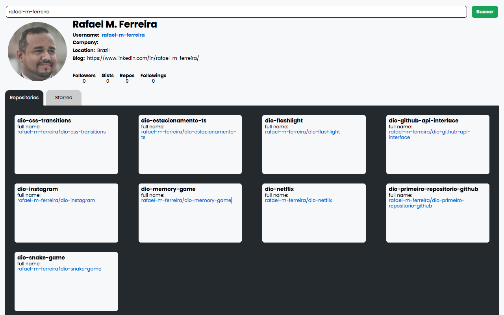

# Desafio de Projeto - Criando um front-end totalmente componentizado na prática com ReactJS

Projeto desenvolvido para o **Desafio de Projeto - Criando um front-end totalmente componentizado na prática com ReactJS** realizado no curso da [Digital Innovation One - DIO](https://www.dio.me/).

## Sobre o projeto

Este projeto foi inicializado com [Create React App](https://github.com/facebook/create-react-app).

Este repositório foi desenvolvido para demonstrar como podemos criar uma aplicação frontend com componentes reutilizáveis.

Para o desenvolvimento da aplicação foi utilizada a [API pública do Github](https://docs.github.com/en/rest/guides/getting-started-with-the-rest-api).

### Recursos

- Exibe informações do usuário pesquisado. 
- Exibe repositórios criado pelo usuário pesquisado.

### Tela

### Bibliotecas utilizadas

- [axios](https://www.npmjs.com/package/axios)
- [react-tabs](https://www.npmjs.com/package/react-tabs)
- [styled-components](https://styled-components.com/)

### Referências

- [Create React App Documentation](https://create-react-app.dev/docs/getting-started)
- [ReactJS Documentation](https://reactjs.org/docs/getting-started.html)
- [GitHub API Documentation](https://docs.github.com/en/rest/guides/getting-started-with-the-rest-api)
   
- [MDN Web Docs referência HTML](https://developer.mozilla.org/pt-BR/docs/Web/HTML/)
- [MDN Web Docs referência CSS](https://developer.mozilla.org/pt-BR/docs/Web/CSS/)
- [MDN Web Docs referência JavaScript](https://developer.mozilla.org/pt-BR/docs/Web/JavaScript/)
